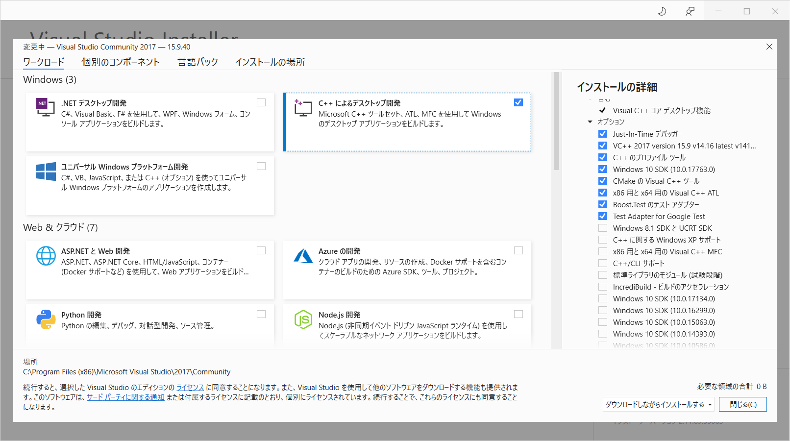
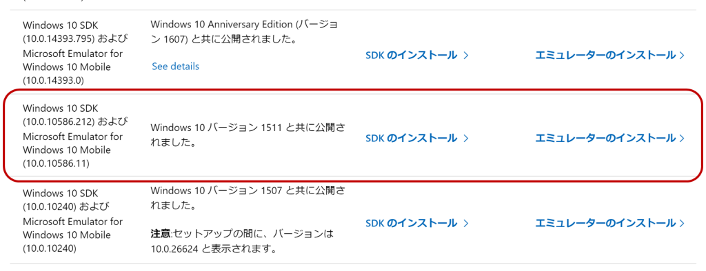
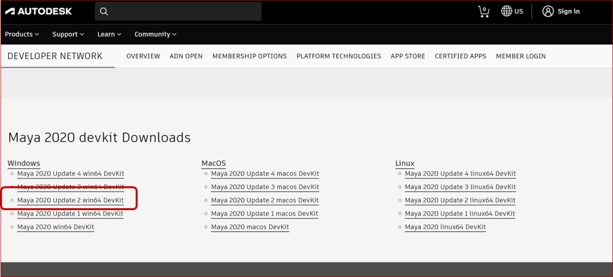
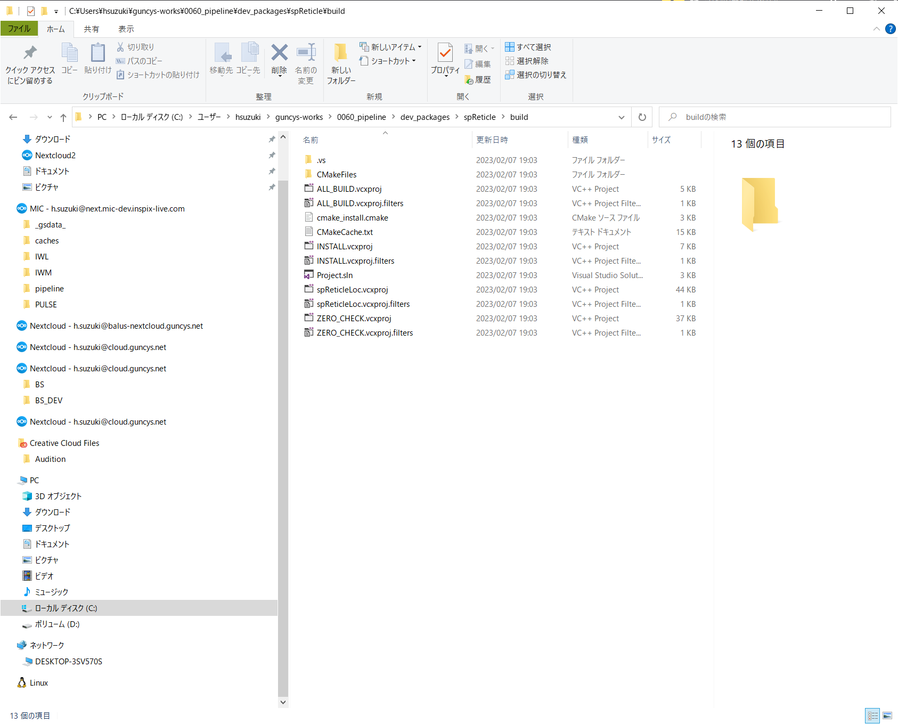
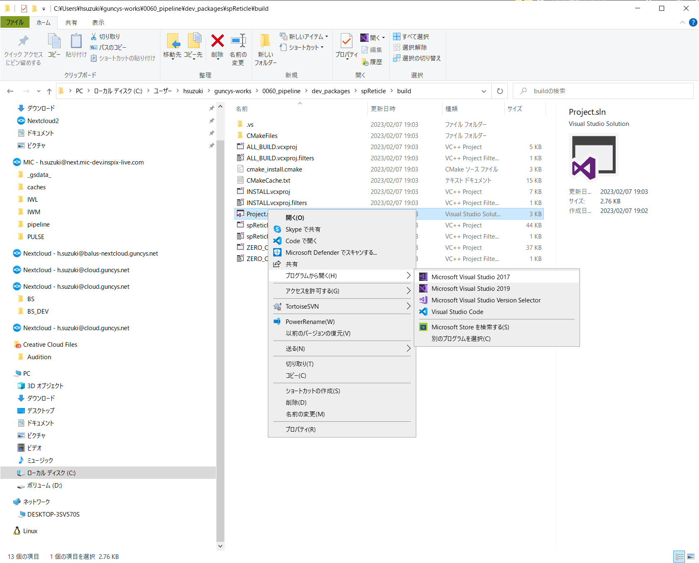
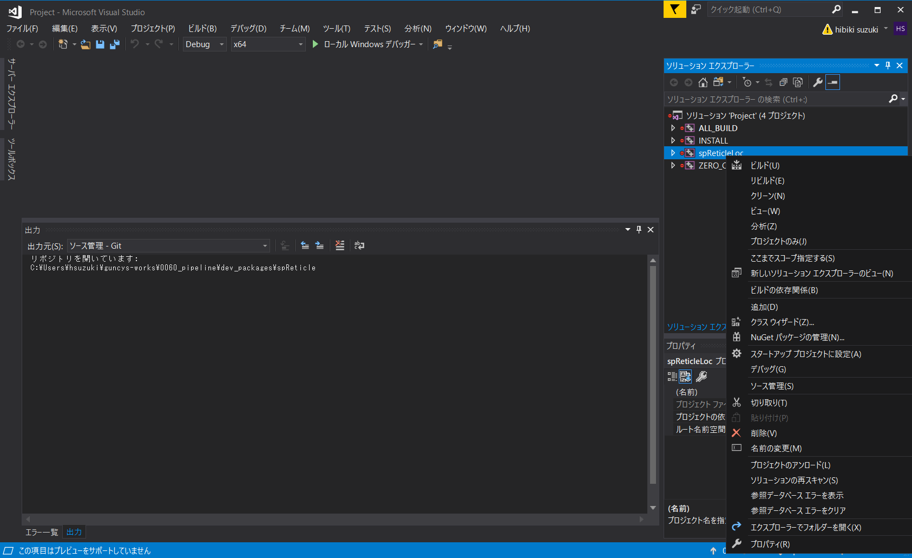
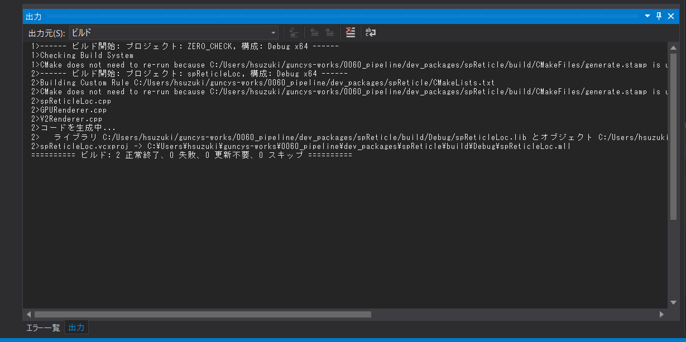
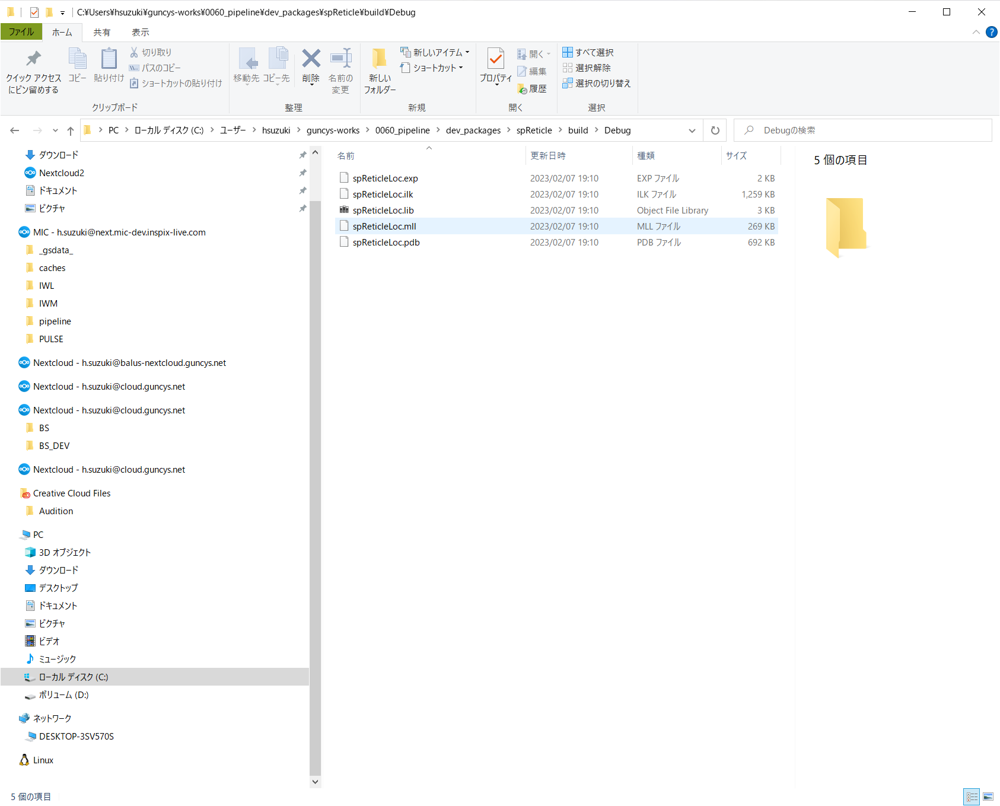

# Windowsでのビルド手順

## 概要
WindowsでMayaのC++プラグインの開発や、ビルドを行う場合はVisual Studioが必要になります。
ビルドのイメージとしては、大体以下の感じです
1. ビルドしたいツールのソースコードを取得
2. ビルドしたいバージョンのMayaとdevKit、VSのビルド環境をインストールする
3. CMakeでソースコードからVisual Studio用プロジェクトを構築する
4. Visual Studioでビルド実行
5. ビルド結果として.mllファイルが出てくる。これをMayaプラグインとして読み込む


## テスト環境
- Maya 2020 Update 4（Windows 10用、日本語版）
- Visual Studio Community 2017

Maya2020.4で確認しました。他のバージョンの場合は適宜置き換えて実行してください。

私の環境ではVisual Studio 2017がインストール済みだったので2017を使用しましたが、下記ページの説明にあるように最新バージョンのVSでもビルドが可能とのことです。

https://mukai-lab.org/library/maya-cpp-plugin/
>Maya 2020のヘルプに記載のとおり、Mayaの各バージョンごとに必要なVisual Studio（以降、VSと略記）のバージョンが異なります。たとえばリンク先に記載のとおり、Maya 2020ではVS2017が必要とされています。ただ、VS Community 2022のような最新バージョンのVSであっても、VS2017と同等のビルド環境を利用できます。言い換えれば、VS2017の製品版をインストールすることなく、VS Community 2022のオプション設定によって必要なビルド環境を整えられます。

## ビルド環境の設定
### Visual Studio Communityのインストール
VS2017を使用する場合の設定方法をまとめます。

VS2017をダウンロードし、インストールします。インストール時にインストールコンポーネントを選択する画面で、「C++によるデスクトップ開発」にチェックを入れます。




※既にインストール済みの場合はVisual Studio Installerを起動してVS2017の「変更」から追加します

.png)


### オプション：Windows SDKの追加
下記ページの説明にしたがってWindowsSDKをインストールします。
Maya 2020.4のWindows SDKバージョンはおそらくMaya 2020.2と同じ Windows SDK Version 10.0.10586.0 だと思われます。（もしかしたら違うかもしれないです。ちょっと調べた限りだとわかりませんでした。）  
とりあえずspReticleに関してはこのSDKバージョンで問題なくビルド＆動作しています。

https://mukai-lab.org/library/maya-cpp-plugin/
>### オプション：Windows SDKの追加  
>個人の研究開発や独習においては必須ではありませんが、Mayaプラグイン開発にあたっては、予期しないエラーをできるだけ回避するために、Windows SDKのバージョンを統一しておくことが望ましいです。まず、Web検索などに頼ってMayaのビルド環境を調べます。基本的には Around the Corner というブログに行き当たることになります。例えばMaya 2020についてはMaya 2020 API update guideという投稿に記載されています。この情報によると、Maya 2020.2 は Windows SDK Version 10.0.10586.0 を用いてビルドされていることがわかります。  
>次に、同一バージョンの Windows SDK をインストールします。Windows SDK とエミュレーターのアーカイブのページを見ると、Windows 10 SDK (10.0.10586.212) という下三桁だけが異なるWindows SDKが見当りますので、こちらをインストールします。なお、下三桁はバグ対応といったマイナーアップデート番号に対応しますので、この番号が異なってもSDKの仕様に差異はありません。
>

### Maya Developer Toolkitの導入 
Windows SDKの追加同様、下記ページに従ってMaya Developer Toolkitをダウンロードし、設定します。
Maya 2020.4に対応する「Maya 2020 Update 4 win64 DevKit」をダウンロードします。

https://mukai-lab.org/library/maya-cpp-plugin/
>### Maya Developer Toolkitの導入  
>Maya デベロッパー センターから、Mayaのバージョンに対応する開発キットをダウンロードします。ここではMaya 2020.2に対応する「Maya 2020 Update 2 win64 DevKit」をダウンロードします。
>
>ダウンロード後は、Mayaヘルプに記載の手順にしたがって圧縮ファイルの展開、フォルダ作成、環境変数の設定等を行います。

### Maya Developer Toolkitのインストール
ダウンロード後の設定方法について[Mayaヘルプ](https://help.autodesk.com/view/MAYAUL/2020/JPN/?guid=__developer_Maya_SDK_MERGED_Setting_up_your_build_Windows_environment_64_bit_html)について記載されていますが、
>5.　`DEVKIT_LOCATION` および `MAYA_LOCATION` 環境変数を追加し、Maya の bin フォルダを含めるように `PATH` 変数を変更します。
>```
>set DEVKIT_LOCATION=C:\Users\<Username>\devkitBase\
>set MAYA_LOCATION="C:\Program Files\Autodesk\<maya_version>"
>set PATH=%PATH%;%MAYA_LOCATION%\bin
>```

手順5について、`MAYA_LOCATION`および`PATH`環境変数の編集は、spReticleのビルドにおいては不要のようです。`DEVKIT_LOCATION`環境変数の定義だけ行います。
```
set DEVKIT_LOCATION=C:\Users\<Username>\devkitBase\
```  

また、複数バージョンのDeveloper Toolkitを扱う場合は、インストールロケーションをバージョン毎のサブフォルダーに分けるなどの工夫をするといいと思います。
```
C:\Users\<Username>\devkitBase\2020.4
```

## spReticleのビルド
### CMakeでVisual Studio用プロジェクトを構築する
以下のコマンドを実行します。
```
git clone https://github.com/mottosso/spReticle.git
cd spReticle
mkdir build
cd build
set DEVKIT_LOCATION=C:\Users\<Username>\devkitBase\
set PATH=C:\Program Files (x86)\Microsoft Visual Studio\2017\Community\Common7\IDE\CommonExtensions\Microsoft\CMake\CMake\bin\;%PATH%
cmake .. -G "Visual Studio 15 2017" -DCMAKE_SYSTEM_VERSION="10.0.10586.0" -A x64
```
`spReticle\build`フォルダーにVisual Studioプロジェクトが作成されます。



### Visual Studioでビルドする
`Project.sln`を選択して「プログラムから開く＞Visual Studio 2017」を開きます。


ソリューションエクスプローラーから`spReticleLoc`を選択してビルドを実行します。


ビルドが完了すると、正常終了のログが表示され、`Debug`フォルダー中にspReticleLoc.mllが書き出されます。




## Mayaを起動して動作確認
Mayaを起動してプラグインファイルをロードし、動作確認してください。